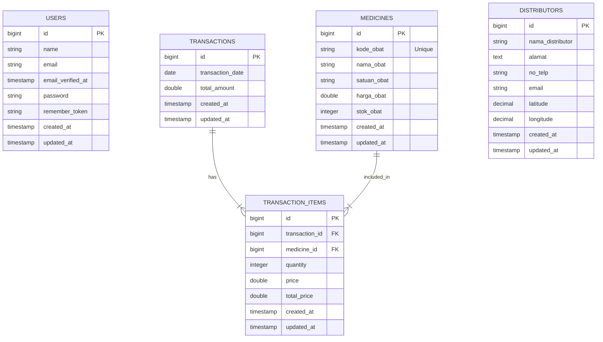

# Entity Relationship Diagram (ERD)

Berikut adalah diagram ERD untuk projek Apotek App berdasarkan struktur database saat ini.

## Penjelasan Relasi

1.  **Transactions - Transaction Items (1:N)**
    -   Satu `Transaction` dapat memiliki banyak `TransactionItem`.
    -   Setiap `TransactionItem` terhubung ke satu `Transaction`.
    -   Relasi ini mendefinisikan detail item apa saja yang dibeli dalam satu transaksi.

2.  **Medicines - Transaction Items (1:N)**
    -   Satu `Medicine` dapat muncul di banyak `TransactionItem` (di berbagai transaksi berbeda).
    -   Setiap `TransactionItem` mereferensikan satu jenis `Medicine`.

3.  **Users**
    -   Tabel ini digunakan untuk autentikasi (Login Admin). Saat ini belum ada relasi langsung ke transaksi (asumsi: transaksi dicatat oleh sistem/kasir umum atau user yang login, namun di database `transactions` belum ada `user_id`).

4.  **Distributors**
    -   Tabel master data untuk menyimpan informasi distributor obat. Saat ini berdiri sendiri sebagai referensi.
